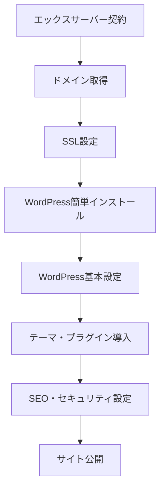

# WordPress運営開始ガイド

このドキュメントは、エックスサーバー契約からWordPressサイト公開までの全手順をまとめたものです。

## 📋 全体の流れ



---

## Phase 1: サーバー・ドメイン契約

### 1-1. エックスサーバー契約

#### 推奨プラン
- **スタンダードプラン**（旧X10）
- 契約期間：**12ヶ月**（月額換算が安く、ドメイン永久無料特典あり）
- 初期費用：0円
- 月額：約1,100円（12ヶ月契約時）

#### 契約手順
1. [エックスサーバー公式サイト](https://www.xserver.ne.jp/)にアクセス
2. 「お申し込み」→「新規お申し込み」を選択
3. プラン選択：**スタンダード**、契約期間：**12ヶ月**
4. WordPressクイックスタート：**利用しない**（後で手動設定する）
5. アカウント情報を入力して申し込み完了
6. 支払い方法を登録（クレジットカード推奨）

> [!TIP]
> キャンペーン期間中は初期費用無料＋ドメイン永久無料の特典があることが多いです。

---

### 1-2. ドメイン取得

#### ドメイン名の決め方
- **LogiShift** → `logishift.com` または `logishift.jp`
- 短く、覚えやすく、ブランドを表現できる名前が理想

#### 取得手順
1. エックスサーバーの管理画面（サーバーパネル）にログイン
2. 「ドメイン」→「ドメイン永久無料特典」を選択
3. 希望のドメイン名を入力して検索
4. 利用可能なら「取得する」をクリック
5. 取得完了（通常数分〜数時間で反映）

> [!IMPORTANT]
> ドメイン取得後、DNS設定が完全に反映されるまで**最大24〜72時間**かかる場合があります。

---

## Phase 2: サーバー初期設定

### 2-1. SSL証明書の設定（HTTPS化）

#### 設定手順
1. サーバーパネル →「SSL設定」を選択
2. 取得したドメインを選択
3. 「独自SSL設定追加」タブをクリック
4. 「確認画面へ進む」→「追加する」
5. 設定完了（反映まで最大1時間程度）

#### 確認方法
- `https://あなたのドメイン.com` にアクセスして、鍵マークが表示されればOK

---

### 2-2. WordPress簡単インストール

#### インストール手順
1. サーバーパネル →「WordPress簡単インストール」を選択
2. 対象ドメインを選択
3. 以下の情報を入力：
   - **サイトURL**: `https://あなたのドメイン.com`（サブディレクトリは空欄）
   - **ブログ名**: LogiShift（後で変更可能）
   - **ユーザー名**: 管理者用のログインID（推測されにくいものを設定）
   - **パスワード**: 強固なパスワード（英数字記号混在、16文字以上推奨）
   - **メールアドレス**: 管理者用メールアドレス
   - **データベース**: 自動でデータベースを生成する
4. 「確認画面へ進む」→「インストールする」
5. 完了画面に表示される**管理画面URL、ユーザー名、パスワード**を必ず保存

> [!CAUTION]
> ユーザー名に `admin` や `administrator` など推測されやすい名前は使わないこと（セキュリティリスク）。

---

## Phase 3: WordPress基本設定

### 3-1. 管理画面にログイン

- URL: `https://あなたのドメイン.com/wp-admin/`
- インストール時に設定したユーザー名とパスワードでログイン

---

### 3-2. 一般設定

**設定 → 一般**

| 項目 | 設定内容 |
|------|----------|
| サイトのタイトル | LogiShift |
| キャッチフレーズ | 物流業界のDX・コスト削減を支援するメディア |
| WordPressアドレス (URL) | `https://あなたのドメイン.com` |
| サイトアドレス (URL) | `https://あなたのドメイン.com` |
| タイムゾーン | 東京 |
| 日付形式 | Y年n月j日 |
| 時刻形式 | H:i |

> [!WARNING]
> **WordPressアドレス**と**サイトアドレス**を間違えるとサイトにアクセスできなくなります。必ず `https://` から始まるURLを正確に入力してください。

---

### 3-3. パーマリンク設定

**設定 → パーマリンク**

- **推奨設定**: カスタム構造 → `/%postname%/`
- これにより、記事URLが `https://logishift.com/記事タイトル/` のような分かりやすい形式になります

> [!TIP]
> パーマリンクは**記事を公開する前に必ず設定**してください。後から変更すると、既存記事のURLが変わりSEO評価がリセットされます。

---

### 3-4. 表示設定

**設定 → 表示設定**

| 項目 | 設定内容 |
|------|----------|
| ホームページの表示 | 最新の投稿 |
| 1ページに表示する最大投稿数 | 10件 |
| 検索エンジンでの表示 | **チェックを外す**（公開準備ができたら） |

> [!IMPORTANT]
> 初期状態では「検索エンジンがサイトをインデックスしないようにする」にチェックが入っている場合があります。サイト公開時には必ず**チェックを外してください**。

---

## Phase 4: テーマ・プラグイン導入

### 4-1. 自作テーマのアップロード

#### アップロード手順
1. **外観 → テーマ** を選択
2. 「新規追加」→「テーマのアップロード」をクリック
3. 自作テーマのZIPファイルを選択してアップロード
4. 「有効化」をクリック

#### テーマの必須ファイル構成
```
your-theme/
├── style.css        # テーマ情報とスタイル
├── index.php        # メインテンプレート
├── functions.php    # テーマ機能の定義
├── header.php       # ヘッダー
├── footer.php       # フッター
├── single.php       # 個別記事ページ
└── screenshot.png   # テーマのサムネイル（推奨）
```

---

### 4-2. 必須プラグインのインストール

**プラグイン → 新規追加** から以下をインストール・有効化：

#### セキュリティ系
- **SiteGuard WP Plugin**
  - 日本製のセキュリティプラグイン
  - ログインURLの変更、画像認証、ログイン履歴などの機能

#### SEO系
- **XML Sitemap & Google News**
  - XMLサイトマップを自動生成
  - Googleサーチコンソールへの登録に必須

#### パフォーマンス系
- **WP Super Cache** または **LiteSpeed Cache**
  - ページキャッシュでサイト高速化
  - エックスサーバーの場合は「LiteSpeed Cache」推奨

#### その他
- **Contact Form 7**（お問い合わせフォーム用）
- **Advanced Custom Fields**（カスタムフィールド管理、必要に応じて）

> [!TIP]
> プラグインは必要最小限に抑えてください。多すぎるとサイトが重くなり、セキュリティリスクも増加します。

---

## Phase 5: SEO・セキュリティ設定

### 5-1. Googleサーチコンソール登録

#### 登録手順
1. [Google Search Console](https://search.google.com/search-console/)にアクセス
2. 「プロパティを追加」→「URLプレフィックス」を選択
3. サイトURL（`https://logishift.com`）を入力
4. 所有権の確認方法を選択：
   - **推奨**: HTMLタグをサイトの`<head>`内に追加
   - または、XMLサイトマッププラグインが生成した`sitemap.xml`を送信

#### サイトマップ送信
1. サーチコンソール左メニュー →「サイトマップ」
2. 新しいサイトマップの追加：`sitemap.xml`
3. 送信完了

---

### 5-2. Googleアナリティクス設定

#### 設定手順
1. [Google Analytics](https://analytics.google.com/)にアクセス
2. 「管理」→「プロパティを作成」
3. プロパティ名：LogiShift
4. タイムゾーン：日本
5. 「ウェブ」を選択してストリームを作成
6. 測定IDをコピー（`G-XXXXXXXXXX`形式）
7. WordPressテーマの`header.php`の`</head>`直前に、Googleアナリティクスのトラッキングコードを追加

---

### 5-3. セキュリティ強化設定

#### SiteGuard WP Pluginの推奨設定
1. **ログインページ変更**: 有効化（デフォルトの`/wp-admin/`から変更）
2. **画像認証**: 有効化
3. **ログイン詳細エラーメッセージの無効化**: 有効化
4. **ログインロック**: 有効化（5回失敗で1時間ロック）
5. **ログイン履歴**: 有効化

#### その他のセキュリティ対策
- **管理者ユーザー名を推測されにくいものにする**（既に設定済み）
- **定期的なバックアップ**：エックスサーバーの自動バックアップ機能を確認
- **WordPress本体・テーマ・プラグインの定期更新**

---

## Phase 6: 自動化スクリプトとの連携

### 6-1. WordPress REST API有効化確認

自動化スクリプト（`generate_article.py`）がWordPress REST APIを使用するため、以下を確認：

1. **設定 → パーマリンク設定** が「基本」以外になっていること（Phase 3で設定済み）
2. REST APIエンドポイントにアクセスして確認：
   ```
   https://あなたのドメイン.com/wp-json/
   ```
   JSONデータが表示されればOK

---

### 6-2. アプリケーションパスワードの生成

#### 生成手順
1. **ユーザー → プロフィール** を選択
2. 下にスクロールして「アプリケーションパスワード」セクションを表示
3. 新しいアプリケーションパスワード名：`Article Automation Script`
4. 「新しいアプリケーションパスワードを追加」をクリック
5. 生成されたパスワードをコピー（**スペースなしで保存**）

#### 環境変数への設定
`generate_article.py`で使用する環境変数ファイル（`.env`）に以下を追加：

```bash
WP_URL=https://あなたのドメイン.com
WP_USERNAME=管理者ユーザー名
WP_APP_PASSWORD=生成したアプリケーションパスワード
```

---

### 6-3. 自動化スクリプトのテスト実行

```bash
cd /Users/matsumotoakira/Documents/Private_development/media/automation
python3 generate_article.py --test
```

正常に記事が下書き保存されることを確認してください。

---

## Phase 7: サイト公開前チェックリスト

### 公開前の最終確認

- [ ] SSL証明書が正しく設定されている（`https://`でアクセス可能）
- [ ] パーマリンク設定が完了している
- [ ] 「検索エンジンでの表示」のチェックが外れている
- [ ] Googleサーチコンソール・アナリティクスが設定済み
- [ ] 必須プラグインがインストール・有効化されている
- [ ] セキュリティ設定（SiteGuard）が完了している
- [ ] 自作テーマが正しく表示される
- [ ] 自動化スクリプトが正常に動作する
- [ ] お問い合わせフォームが機能する（Contact Form 7）
- [ ] プライバシーポリシーページを作成している
- [ ] 最低5〜10記事を公開している（初期コンテンツ）

---

## Phase 8: 公開後の運用タスク

### 定期メンテナンス

#### 毎週
- [ ] WordPress本体・プラグインの更新確認
- [ ] サーチコンソールでエラーチェック
- [ ] アナリティクスでアクセス状況確認

#### 毎月
- [ ] バックアップの確認（エックスサーバーの自動バックアップ）
- [ ] セキュリティログの確認（SiteGuard）
- [ ] サイト表示速度のチェック（PageSpeed Insights）

#### 3ヶ月ごと
- [ ] 記事のリライト・更新
- [ ] 内部リンクの最適化
- [ ] 不要なプラグインの削除

---

## トラブルシューティング

### よくある問題と解決方法

#### 1. サイトにアクセスできない
- DNS設定の反映待ち（最大72時間）
- SSL証明書の設定ミス → サーバーパネルで再設定

#### 2. 管理画面にログインできない
- ログインURLが変更されている → SiteGuardの設定を確認
- パスワードを忘れた → 「パスワードをお忘れですか？」からリセット

#### 3. 記事が自動投稿されない
- REST APIが無効化されている → パーマリンク設定を確認
- アプリケーションパスワードが間違っている → 再生成して`.env`を更新

#### 4. サイトが重い
- プラグインが多すぎる → 不要なものを無効化
- キャッシュプラグインが未設定 → LiteSpeed Cacheを導入

---

## 参考リンク

- [エックスサーバー公式マニュアル](https://www.xserver.ne.jp/manual/)
- [WordPress Codex 日本語版](https://wpdocs.osdn.jp/)
- [Google Search Console ヘルプ](https://support.google.com/webmasters/)
- [PageSpeed Insights](https://pagespeed.web.dev/)

---

## 次のステップ

このガイドに従ってサイトを公開したら、以下のドキュメントも参照してください：

- [automation_strategy.md](file:///Users/matsumotoakira/Documents/Private_development/media/docs/03_automation/automation_strategy.md) - 記事自動生成の運用方法
- [GEMINI.md](file:///Users/matsumotoakira/Documents/Private_development/media/GEMINI.md) - コンテンツ制作ガイドライン
